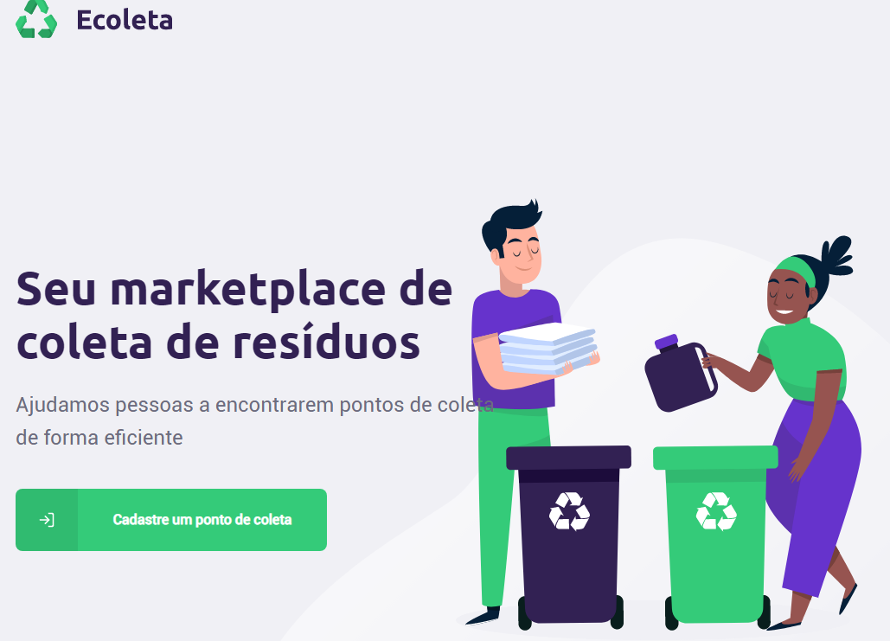
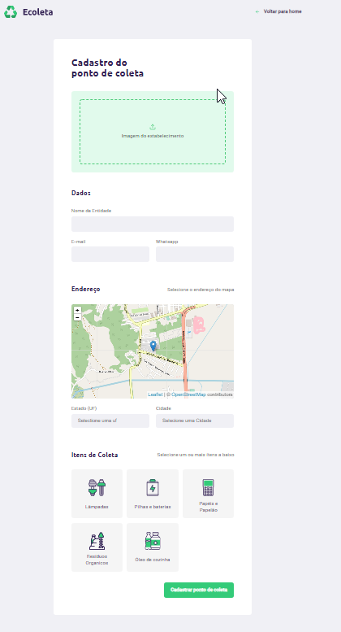
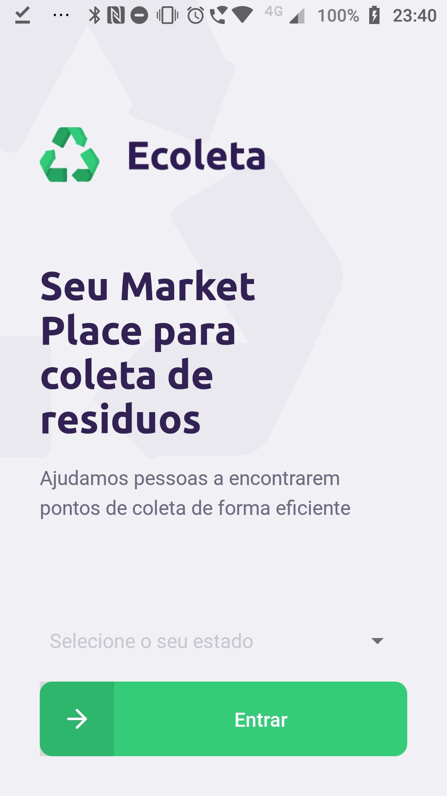
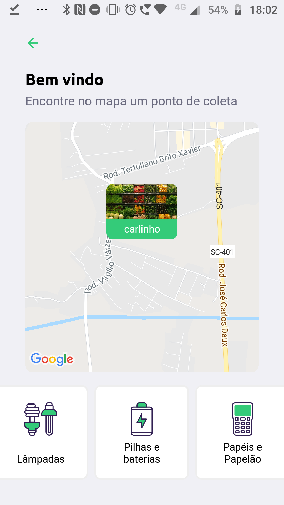
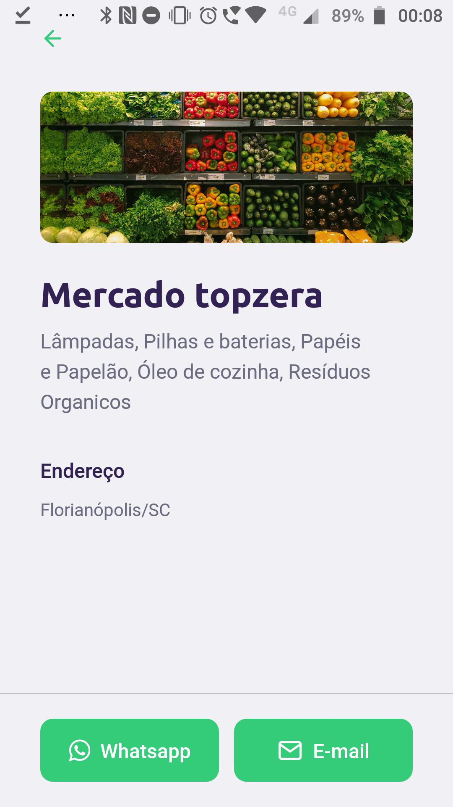

# Projeto desenvolvido no NextLevel para estudo

Projeto de criação de um front-end para cadastro de pontos de coletas

O projeto foi divido em 3 partes:

* Backend (Node/Express)
* Front-end (React)
* Mobile (React Native)

## Backend

Desenvolvido com NodeJS e express

Foram desenvolvidos os seguintes endpoints:

 **Listagem dos items reciclados:** `http://localhost:3333/items`

 **Cadastro dos pontos de coletas:** `http://localhost:3333/points`
 
 Dados passados no form:
 * name
 * email
 * whatsapp
 * latitude
 * longitude
 * city
 * uf
 * items
 * image

 Foi adicionado validação dos dados usando `celebrate` e para upload de imagens foi utilizado o `multer`.

  
 **Listagem de pontos de coletas por filtros:** `http://localhost:3333/points/`
 
 Dados passados na query string:

 city, uf e items, onde items são os códigos separados por vírgula
  e recuperação de um ponto de coleta específico:

### Banco de dados

Foi utilizado knex para conexão de banco de dados e o banco de dados sqlite.
Foi criado um seed para alimentação do banco de dados.

## Front End

No Front end foi criado uma landing page

Ao entrar será apresentado um formuário para cadastro de pontos de coleta:

Função do cadastro:

Permitir o cadastro de pontos de coletas de lixos reciclaveis

Recursos utilizados no cadastro:

* Drag and drop (Dropzone)
* Carregamento de UFs/Municipios pela API do [IBGE](https://servicodados.ibge.gov.br/api/docs/) usando axios
* Consumo do backend desenvolvido para carregar os itens do ponto de coleta e carregamento de suas imagens
* Envio (Post) do ponto de coleta enviando Multpart form com a imagem

## Mobile

### Landing page

O projeto foi desenvolvido usando React Native e [expo.io](https://expo.io/).
Foi ensiado como utilizar fontes do google no projeto, criar estilos, enviar parametros para entre as telas, utilizar mapas, imagens e consumir um webservice.

**Funcionalidades:**
Landing page onde o usuário escolhe o estado e a cidade onde quer consultar os pontos de coleta:

A segunda tela é onde são exibidos os pontos de coletas cadastrados.

No mapa é mostrados os pontos de coletas próximos ao usuário, ao afastar o zoom do mapa é possível ver todos os pontos de coletas dentro da visualização

Ao clicar no icone o usuário é direcionado para página que exibe os detalhes do ponto de coleta

# Como executar o projeto? #

Pré requisitos:
* NodeJS
* React
* Expo

**Backend**

Primeiro é necessário executar backend e rodar o seed para alimentar o banco de dados.

**Para primeira** vez é necessário criar o banco de dados e rodar o seed:

`yarn knex:migrate`

`yarn knex:seed`

Agora suba o servidor:

`yarn dev`

**Frontend**

Na pasta web execute o script:

`yarn start`

**Mobile** 

É necessário ter o expo instalado

`yarn global add expo-cli`

depois execute:

`yarn install`

Se tudo der certo, será aberto uma página do expo com um código QRCODE.

Instale o explo no seu celular e escaneie o Qrcode usando o app do expo e o aplicativo 
será aberto no celular.

